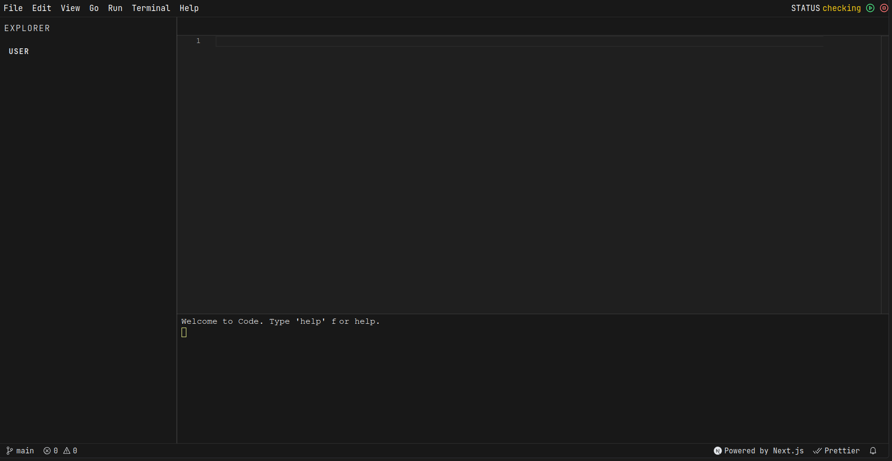

# TurboRepo Project with Next.js, Reverse Proxy using traefik and Dockerode (aws-sdk for aws ecs-ec2) , and node-pty Client-Specific Containers using Socket

This project uses TurboRepo to manage a multi-repository setup, including:

1. A Next.js application.
2. A reverse proxy Docker container.
3. Client-specific Docker containers for handling individual connections via WebSocket.
4. xterm.js for terminal emulation.
5. Monaco Editor for the file explorer in the app.

Images

## Project Structure

    .
    ├── /apps
    │   └── client    # Next.js client application
    ├── /packages
    │   └── docker
    │       ├── reverse-proxy  # Docker image for reverse proxy setup
    │       └── client-docker  # Docker container setup for each client
    └── turbo.json             # TurboRepo configuration

## Features

Reverse Proxy: Manages client connections dynamically, routing requests to user-specific containers.
Client-Specific Containers: Each user gets a dedicated Docker container, ensuring isolated terminal sessions.
WebSocket Support: For real-time communication between the Next.js app and Docker containers.
Terminal Interface: Powered by xterm.js.
Monaco Editor: A powerful code editor for exploring and modifying files inside the containers.

## Prerequisites

1. Docker installed on your machine.
2. pnpm as the package manager.
3. TurboRepo configured (comes with pnpm).

## Installation

#### Clone the repository and navigate into it:

    bash

    git clone <repository-url>
    cd <project-directory>

#### Install dependencies:

    bash

    pnpm install

#### Run Locally

Start Docker:
Ensure Docker is running on your machine.

#### Build the project:

    bash

    pnpm build-server    # Build the websocket conatiner node-pty
    pnpm build-proxy     # Build the reverse proxy Docker image

#### Start development server:

    bash

    pnpm dev             # Start the Next.js development server

#### Start the reverse proxy:

    bash

    pnpm start-proxy     # Start the reverse proxy Docker container

## Usage

1. Open the Next.js app in your browser.
2. On login or interaction, a client-specific Docker container is spun up.
3. The reverse proxy will forward the request to the correct container (e.g., userid.localhost).
4. Use the xterm.js terminal for interacting with the container and the Monaco Editor for exploring files.

## Troubleshooting

Docker Issues: Ensure Docker is running and containers are not blocked by the firewall.
WebSocket Connections: Verify that the reverse proxy correctly forwards WebSocket traffic.
pnpm Issues: If commands fail, try running:

    bash

    pnpm clean
    pnpm install

## Contributing

Feel free to submit issues or pull requests to improve this project.
License

This project is licensed under the MIT License.
Contact

## For any questions, please contact [SimplyRohit] at [rohitjaatjaat073@gmail.com].
